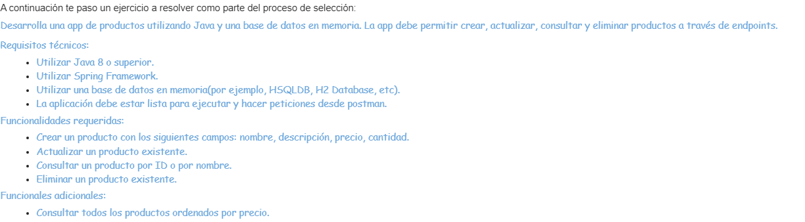

# 💻 Prueba tecnica JAVA JR [PAYGOAL](https://www.paygoal.com.ar/)

  Esta fue una prueba tecnica para JAVA JR para la empresa **[PAYGOAL](https://www.paygoal.com.ar/)**
  
## 📋 Consigna

## 📋 Tecnologias
- Environment 
  - [Java17](https://www.oracle.com/ar/java/technologies/downloads/)
  - [Springboot](https://spring.io/)
  - [IntelliJ IDEA](https://www.jetbrains.com/idea/download)
  - [Postman](https://www.postman.com/product/rest-client/)
 
## 🔧 Instalación y uso
  Si deseas correr la API RESTFUL en un entorno local debes tener en cuenta lo siguiente: 
  1. Clona el repositorio utilizando GIT o descargando el archivo ZIP:

      `git clone https://github.com/lnxxxxxxxx/PruebaTecnicaJavaJr.git`
      
  2. Abrelo en Intellij IDEA, corre springboot:maven:run.
  
  3. Abre Postman, utiliza los endpoints y sus metodos GET,POST,PUT,DELETE.
   - Endpoint:
     - Buscar todos los productos: *GET* /productos 
     - Crear productos: *POST* /productos
     - Actualizar productos: *PUT* /productos/{id o nombre del producto}
     - Buscar productos: *GET* /productos/{id o nombre del producto}
     - Borrar productos: *DELETE* /productos/{id o nombre del producto}
     
     

## 🔎 Feedback de la empresa 
  La empresa me dio unas consignas para mejorar el api restful a tener en cuenta mas alla de su consigna enviada por email.
  1. Agregar capa service. ✅
  2. Agregar capa DTO, Mapper. ✅
  
  - Puntos adicionales que agregue por mi cuenta:
    - Validaciones para no repetir nombre o id al crear
    - Eliminar o actualizar el producto por id o nombre
    - Interface para la capa Service
    - Indentancion en el codigo.
    - Inyeccion de dependencias

 **Ambas ya estan agregadas y los puntos adicionales tambien, el proyecto lo di por finalizado temporalmente.**

